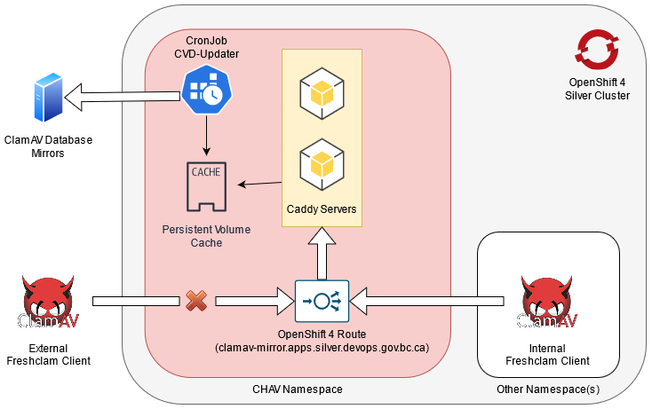

# Application on Openshift

This application can be deployed onto Openshift. This readme will outline how to setup and configure an Openshift project to get the application to a deployable state. This document assumes a working knowledge of Kubernetes/Openshift container orchestration concepts (i.e. buildconfigs, deployconfigs, imagestreams, secrets, configmaps, routes, networkpolicies, etc)

## Table of Contents

- [Infrastructure](#infrastructure)
- [Openshift Deployment Prerequisites](#openshift-deployment-prerequisites)
- [Environment Setup - ConfigMaps and Secrets](#environment-setup---configmaps-and-secrets)
- [Build Config & Deployment](#build-config--deployment)
- [Templates](#templates)
- [Pull Request Cleanup](#pull-request-cleanup)

## Infrastructure

This application has a relatively simple architecture to achieve the following:

1. Act as a mirror for the ClamAV Database files within the cluster
2. Periodically fetch and update the definition files from upstream

  
**Figure 1 - General Openshift infrastructure diagram**

We achieve the first objective by leveraging Caddy in High Availability mode to host the files, and utilize an Openshift CronJob to update the definition files 3 times a day using the cvdupdate library. The definition files are stored on a persistent volume claim and updated as needed. In order to minimize the potential attack surface, we drop all network traffic that does not come from the cluster itself in the Openshift route definition.

## Openshift Deployment Prerequisites

We assume you are logged into OpenShift and are in the repo/openshift local directory.  We will run the scripts from there.

### Add Default Kubernetes Network Policies

Your namespace should already be a Network Policy named similar to `platform-services-controlled-deny-by-default`. Before deploying, ensure that you have the Network Policy `allow-from-openshift-ingress` by running the following:

``` sh
export NAMESPACE=<yournamespace>

oc process -n $NAMESPACE -f https://raw.githubusercontent.com/wiki/bcgov/nr-get-token/assets/templates/default.np.yaml | oc apply -n $NAMESPACE -f -
```

## Environment Setup - ConfigMaps and Secrets

This application requires a Config Map to define the Caddyfile configuration. However, this is embedded as a part of the deployment template, so no manual steps are required to have it be deployed. This application does not need to manage secrets.

## Build Config & Deployment

This application is currently designed as a single application pod deployment. It will host a Caddy static frontend which will host all of the ClamAV Database definitions. We are currently leveraging Openshift Routes to forward incoming traffic to the right deployment service. The application can also update the database definitions at any time via a different entrypoint command.

## Templates

The Jenkins pipeline heavily leverages Openshift Templates in order to ensure that all of the environment variables, settings, and contexts are pushed to Openshift correctly. Files ending with `.bc.yaml` specify the build configurations, while files ending with `.dc.yaml` specify the components required for deployment.

### Build Configurations

Build configurations will emit and handle the chained builds or standard builds as necessary. They take in the following parameters:

| Name | Required | Description |
| --- | --- | --- |
| BASE_IMAGE | yes | Base Image to build from |
| REPO_NAME | yes | Application repository name |
| SOURCE_REPO_REF | yes | Git Pull Request Reference (i.e. 'pull/CHANGE_ID/head') |
| SOURCE_REPO_URL | yes | Git Repository URL |

The template can be manually invoked and deployed via Openshift CLI. For example:

```sh
export NAMESPACE=<yournamespace>

oc process -n $NAMESPACE -f openshift/app.bc.yaml -p REPO_NAME=clamav-mirror -p SOURCE_REPO_URL=https://github.com/bcgov/clamav-mirror.git -p SOURCE_REPO_REF=master -o yaml | oc apply -n $NAMESPACE -f -
```

Note that these build configurations do not have any triggers defined. They need to be started manually in the console, or by an equivalent oc command for example:

```sh
oc start-build -n $NAMESPACE <buildname> --follow
```

While this deployment does not use explicitly managed tags (sticks with the latest build tag instead), we generally tag the resultant image so that the deployment config will know which exact image to use. The equivalent oc command for example is:

```sh
oc tag -n $NAMESPACE <buildname>:latest <buildname>:master
```

*Note: Remember to swap out the bracketed values with the appropriate values!*

### Deployment Configurations

Deployment configurations will emit and handle the deployment lifecycles of running containers based off of the previously built images. They generally contain a deploymentconfig, a service, and a route.

Our application template take in mainly the following parameters:

| Name | Required | Description |
| --- | --- | --- |
| APP_NAME | yes | short name for the application |
| INSTANCE | yes | The name of this instance of the application |
| NAMESPACE | yes | which namespace/"environment" are we deploying to? dev, test, prod? |
| REPO_NAME | yes | Application repository name |
| ROUTE_HOST | yes | The host the route will use to expose service outside cluster |

Deployment invocation can be done manually with the following for example:

```sh
export NAMESPACE=<yournamespace>
export APP_NAME=<yourappshortname>

oc process -n $NAMESPACE -f openshift/app.dc.yaml -p APP_NAME=$APP_NAME -p INSTANCE=master -p NAMESPACE=$NAMESPACE -p REPO_NAME=clamav-mirror -p ROUTE_HOST=clamav-mirror.apps.silver.devops.gov.bc.ca -o yaml | oc apply -n $NAMESPACE -f -
```

Due to the triggers that are set in the deploymentconfig, the deployment will begin automatically. However, you can deploy manually by use the following command for example:

```sh
oc rollout -n $NAMESPACE latest dc/<buildname>
```

*Note: Remember to swap out the bracketed values with the appropriate values!*

### Cronjob Configurations

This application also supports a periodic update via a CronJob based off of the previously built images. They are generally time-restricted tasks.

Our application template take in mainly the following parameters:

| Name | Required | Description |
| --- | --- | --- |
| APP_NAME | yes | short name for the application |
| INSTANCE | yes | The name of this instance of the application |
| NAMESPACE | yes | which namespace/"environment" are we deploying to? dev, test, prod? |
| REPO_NAME | yes | Application repository name |
| CRON_SCHEDULE | no | CronJob crontab schedule |

Cronjob invocation can be done manually with the following for example:

```sh
export NAMESPACE=<yournamespace>
export APP_NAME=<yourappshortname>

oc process -n $NAMESPACE -f openshift/app.cronjob.yaml -p APP_NAME=$APP_NAME -p INSTANCE=master -p NAMESPACE=$NAMESPACE -p REPO_NAME=clamav-mirror -o yaml | oc apply -n $NAMESPACE -f -
```

#### Manual Run

This CronJob will run based off of the specified `CRON_SCHEDULE`, which defaults to `0 */8 * * *` or running once every 8 hours. However, you can run the job manually by use the following command for example:

```sh
export NAMESPACE=<yournamespace>
export APP_NAME=<yourappshortname>

oc create -n $NAMESPACE job --from=cronjob/$APP_NAME-updater "$APP_NAME-updater-manual-$(date +%s)"
```

If the update runs successfully, it will show as 'Completed', and you can inspect the logs.

Make sure to clean up your temporary pod when you are done with the following:

```sh
export NAMESPACE=<yournamespace>

# Note: When there are no jobs to delete, you will get an error for oc delete.
oc get job -n $NAMESPACE -o name | grep -F -e '-manual-' | xargs oc delete -n $NAMESPACE
```

*Note: Remember to swap out the bracketed values with the appropriate values!*

## Pull Request Cleanup

As of this time, we do not automatically clean up resources generated by a Pull Request once it has been accepted and merged in. This is still a manual process. Our PR deployments are all named in the format "pr-###", where the ### is the number of the specific PR. In order to clear all resources for a specific PR, run the following two commands to delete all relevant resources from the Openshift project (replacing `PRNUMBER` with the appropriate number):

```sh
export NAMESPACE=<yournamespace>
export APP_NAME=<yourappshortname>

oc delete all,secret,pvc,networkpolicy -n $NAMESPACE -l app=$APP_NAME-app
```

The command will clear out all related executable resources for the application associated with that PR.
